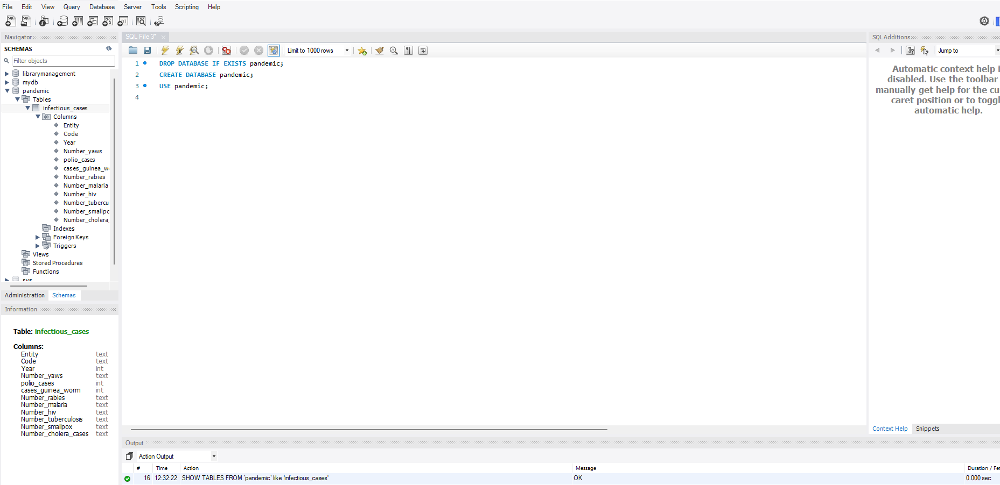
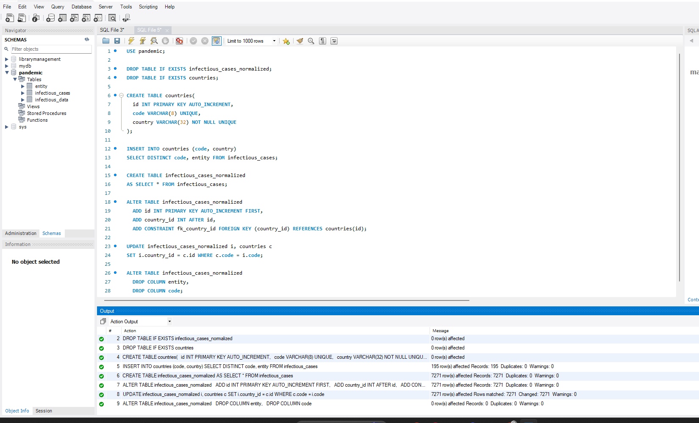
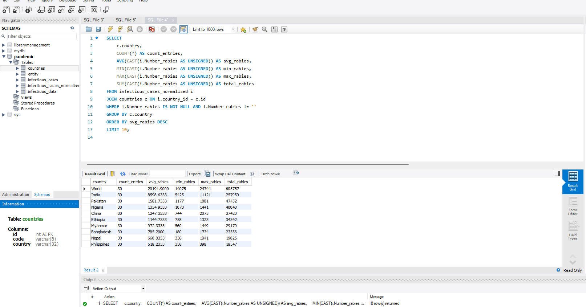
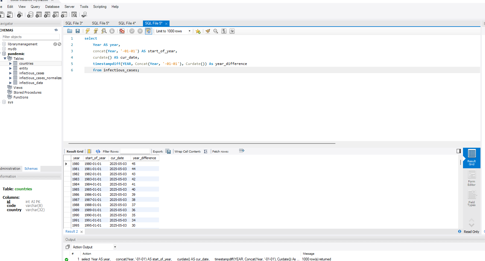
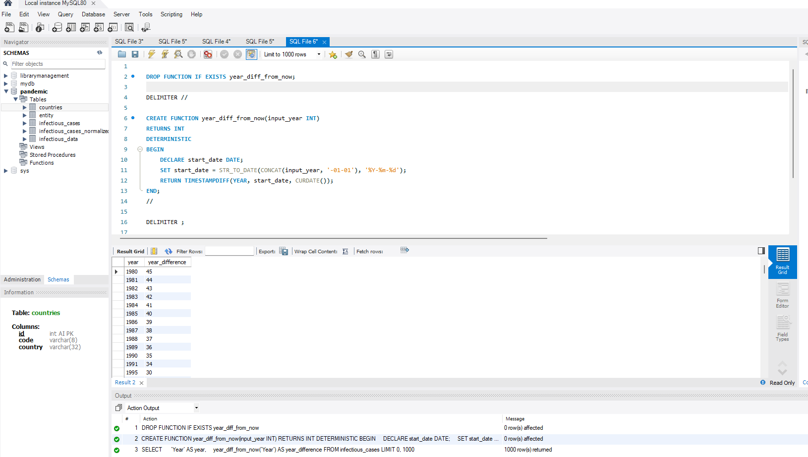

## Завдання

### 1. Завантажте дані

- Створіть **схему `pandemic`** у базі даних за допомогою SQL-команди.
- Оберіть її як **схему за замовчуванням** за допомогою SQL-команди.
- Імпортуйте дані за допомогою **Import wizard**, так як ви вже робили це у *темі 3*.
- Продивіться дані, щоб бути у контексті.

> 💡 Як бачите, атрибути `Entity` та `Code` постійно повторюються. Позбудьтеся цього за допомогою **нормалізації даних**.

---

### 2. Нормалізуйте таблицю `infectious_cases` до 3-ї нормальної форми

- Збережіть у цій же схемі **дві таблиці з нормалізованими даними**.
- Виконайте запит:
  ```sql
  SELECT COUNT(*) FROM infectious_cases;

### 3. Проаналізуйте дані

- Для кожної **унікальної комбінації** `Entity` та `Code` або їх `id` порахуйте:
  - **середнє**
  - **мінімальне**
  - **максимальне значення**
  - **суму**  
  для атрибута `Number_rabies`.

> 💡 Врахуйте, що атрибут `Number_rabies` може містити порожні значення `‘’` — вам попередньо необхідно їх **відфільтрувати**.

- Результат **відсортуйте за порахованим середнім значенням у порядку спадання**.
- Оберіть **тільки 10 рядків** для виведення на екран.

---

### 4. Побудуйте колонку різниці в роках

- Для оригінальної або нормованої таблиці для колонки `Year` побудуйте за допомогою **вбудованих SQL-функцій**:
  - атрибут, що створює **дату першого січня відповідного року**  
    > 💡 Наприклад, якщо атрибут містить значення `1996`, то значення нового атрибута має бути `1996-01-01`.
  - атрибут, що дорівнює **поточній даті**
  - атрибут, що дорівнює **різниці в роках** двох вищезгаданих колонок

> 💡 Перераховувати всі інші атрибути, такі як `Number_malaria`, **не потрібно**.  
> 👉🏼 Для пошуку необхідних вбудованих функцій вам може знадобитися **матеріал до теми 7**.

---

### 5. Побудуйте власну функцію

- Створіть і використайте **функцію**, що будує такий же атрибут, як і в попередньому завданні:
  - функція має **приймати на вхід значення року**
  - **повертати різницю в роках** між поточною датою та датою, створеною з атрибута року  
    > Наприклад: `1996 рік → 1996-01-01`






